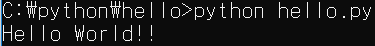

# python01

## Hello World!


Open Hello directory on VSCode

New File **Hello.py**

Write code 




```python
print("Hello World!")
```



Run Code

```bash
python Hello.py
```



## Python **Interpreter**

Workspace로 이동

```bash
C:\python\hello>cd /
C:>cd python
C:\python>cd hello
```

Python Interpreter 실행

```bash
C:\python\hello>python
```

```bash
>>> 10 + 20
30
>>> print("Hello World!")
Hello World!
>>> 20 > 10
True
```

## 변수\(Variables\)

### **1. 정수, 실수, 논리**

```bash
>>> num = 30
>>> num = 3.24
>>> 3 + 4 * 5
23
>>> 3 + 4 * 5 - 4 / 2
21.0
>>> 2 ** 10
1024
>>> 4 // 2
2
>>> 4 /2
2.0
>>> 21 % 2
1
>>> 20 > 10
True
>>> 20 > 10 and 5 >= 4
True
>>> not 5 > 10
True
```

```bash
>>> type(4//2)
<class 'int'>
>>> type(4/2)
<class 'float'>
```

### 2. 문자열 

str = **List\(Array\) of Character**

```bash
>>> 'Hello' "World"
'HelloWorld'
>>> print('Hello' "World")
HelloWorld
>>> message = "Hello World"
>>> print(message)
Hello World
>>> message[0:7]
'Hello W'
>>> message[:7]
'Hello W'
>>> message[:-7]
'Hell'
>>> len(message)
11
>>> message[3:len(message)]
'lo World'
>>> message.split(' ')
['Hello', 'World']
>>> x, y, z = 10, 20, 30
>>> print(x,y,z)
10 20 30
>>> first, second = message.split(" ")
>>> print(first, second)
Hello World
>>> first + ' ' + second
'Hello World'
>>> first * 3 + second
'HelloHelloHelloWorld'
>>> first < second
True
>>> "Your name is {}".format("홍길동")
'Your name is 홍길동'
>>> "Your name is {}, age is {}".format("홍길동",20)
'Your name is 홍길동, age is 20'
>>> "Num is {:03d}".format(23)
'Num is 023'
>>> "Num is {:3f}".format(23)
'Num is 23.000000'
```

```bash
>>> s = "abcd123"
>>> s.upper()
'ABCD123'
>>> s.capitalize()
'Abcd123'
>>> s = " abcd123 "
>>> s.strip()
'abcd123'
>>> s.capitalize()
' abcd123 '
>>> s.strip().capitalize()
'Abcd123'
>>> s.find('d')
4
>>> s.isalnum()
False
>>> s.strip().isalnum()
True
>>> "123".isdigit()
True
>>> int("123")
123
>>> "isupper".isidentifier()
True
>>> import random
>>> dir(random)
['BPF', 'LOG4', 'NV_MAGICCONST', 'RECIP_BPF', 'Random', 'SG_MAGICCONST', 'SystemRandom', 'TWOPI', '_BuiltinMethodType', '_MethodType', '_Sequence', '_Set', '__all__', '__builtins__', '__cached__', '__doc__', '__file__', '__loader__', '__name__', '__package__', '__spec__', '_acos', '_bisect', '_ceil', '_cos', '_e', '_exp', '_inst', '_itertools', '_log', '_os', '_pi', '_random', '_sha512', '_sin', '_sqrt', '_test', '_test_generator', '_urandom', '_warn', 'betavariate', 'choice', 'choices', 'expovariate', 'gammavariate', 'gauss', 'getrandbits', 'getstate', 'lognormvariate', 'normalvariate', 'paretovariate', 'randint', 'random', 'randrange', 'sample', 'seed', 'setstate', 'shuffle', 'triangular', 'uniform', 'vonmisesvariate', 'weibullvariate']
>>> "Your name is {}".format("길동")
'Your name is 길동'
>>> "A is {}, B is {}".format("a","b")
'A is a, B is b'
>>> "{:b}".format(7)
'111'
>>> "{:f}".format(7)
'7.000000'
>>> "Num is {:05d}".format(23)
'Num is 00023'
>>> "Num is {:+05d}".format(-23)
'Num is -0023'
>>> "{:+015.3f}".format(23.34434)
'+0000000023.344'
>>> "{:+015.7f}".format(23.34)
'+000023.3400000'
```

## Composite Operation 복합연산자

```bash
>>> x = 30
>>> x += 10
>>> print(x)
40
>>> x -= 10
>>> print(x)
30

>>> x++
  File "<stdin>", line 1
    x++
      ^
SyntaxError: invalid syntax
# Python에서는 x++, x-- 사용할 수 없다!
```

```bash
>>> x = 1
>>> x += 1 # x++ , x = x + 1
>>> print(x)
2
>>> x -= 1 # x-- , x = x - 1
>>> print(x)
1
```

```bash
>>> s = "안녕하세요"
>>> s += "Hi~"
>>> print(s)
안녕하세요Hi~
```

## Casting 형변환

```bash
# String to Int or Float
>>> si, sf = "3", "3.5"
>>> i, f = int(si), float(sf)
>>> print(i, f)
3 3.5
>>> print(type(i), type(f))
<class 'int'> <class 'float'>

>>> si, sf = "3", "3.5"
>>> float(sf)
3.5
>>> float(si)
3.0
>>> str(23)
'23'
>>> type(str(23))
<class 'str'>
```

