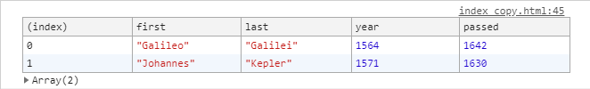
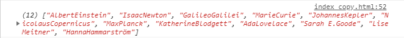
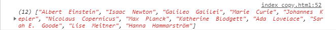
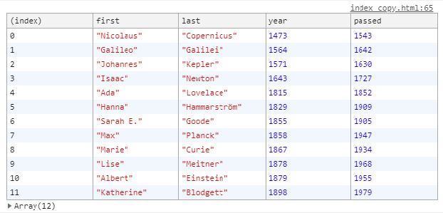
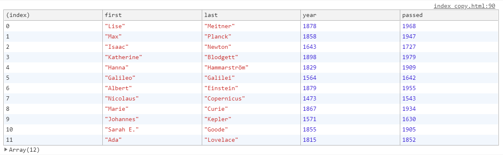

# [Day04] Array Cardio Day 1

### 코드

[04 - Array Cardio Day 1](https://github.com/bhy304/JavaScript30/tree/master/04%20-%20Array%20Cardio%20Day%201)

------

### 개요

Array 메소드를 배워봅시다!!

------

### 학습 내용

#### 1. Array.prototype.filter()
```filter()``` 메서드는 주어진 함수의 테스트를 통과하는 모든 요소를 모아 새로운 배열로 반환한다. 
```javascript
// get people who were born in the 1500s
const fifteen = inventors.filter(function(inventor) {
    if(inventor.year >= 1500 && inventor.year < 1600) {
        return true; // keep it!
    } 
});
console.log(fifteen);
```

💡 Arrow Function 사용
```javascript
const fifteen = inventors.filter(inventor => inventor.year >= 1500 && inventor.year < 1600);

console.log(fifteen);
```

#### 2. Array.prototype.map()
```map()``` 메서드는 배열 내의 모든 요소 각각에 대하여 주어진 함수를 호출한 결과를 모아 새로운 배열을 반환한다. 
```javascript
const fullNames = inventors.map(inventor => inventor.first + inventor.last);
console.log(fullNames);
```

💡 Backtick(``)을 이용한 템플릿 리터럴(Template literal) 사용
```javascript
const fullNames = inventors.map(inventor => `${inventor.first}  ${inventor.last}`);
console.log(fullNames);
```


#### 3. Array.prototype.sort()
```sort()``` 메서드는 배열의 요소를 적절한 위치에 정렬한 후 그 배열을 반환한다. 
```javascript
// Sort the inventors by birthdate, oldest to youngest
const ordered = inventors.sort(function(a, b) {
    if(a.year > b.year) {
        return 1;
    } else {
        return -1;
    }
});
console.table(ordered);
```

💡 삼항 조건 연산자(Ternary Operator) 
```javascript
const ordered = inventors.sort((a, b) => a.year > b.year ? 1 : -1);
```

#### 4. Array.prototype.reduce()
```reduce()``` 메서드는 배열의 각 요소에 대해 주어진 reducer 함수를 실행하고, 하나의 결과값을 반환한다. 
```javascript
var totalYears = 0;
for(var i = 0; i < inventors.length; i++) {
    totalYears += inventors[i].year;
}
console.log(totalYears);
```
reduce 함수는 두 개의 파라미터를 받는데 첫 번째는 reducer 함수, 두 번째는 초기값이다. <br>
```javascript
const totalYears = inventors.reduce((total, inventor) => {
    return total + (inventor.passed - inventor.year);
}, 0); // 0으로 초기값 제공
console.log(totalYears);
```
#### 5. sort the inventors by years lived
```javascript
const oldest = inventors.sort(function(a, b) {
    const lastGuy = a.passed - a.year;
    const nextGuy = b.passed - b.year;
    if(lastGuy > nextGuy) {
        return -1;
    } else {
        return 1;
    }
});
```
💡 삼항조건연산자 사용해서 if문 단축
```javascript
const oldest = inventors.sort(function(a, b) {
    const lastGuy = a.passed - a.year;
    const nextGuy = b.passed - b.year;
    return lastGuy > nextGuy ? -1 : 1;
});
console.table(oldest);
```
